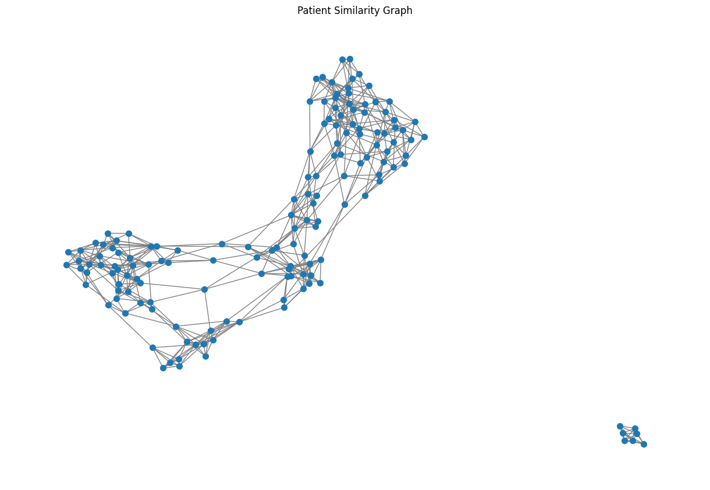
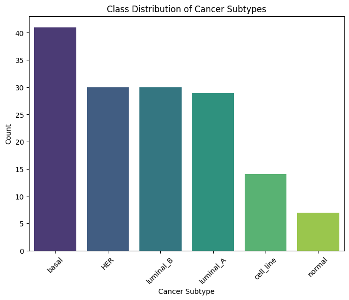
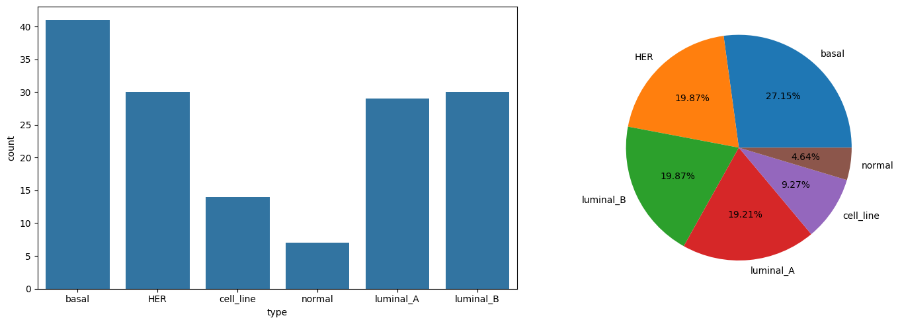
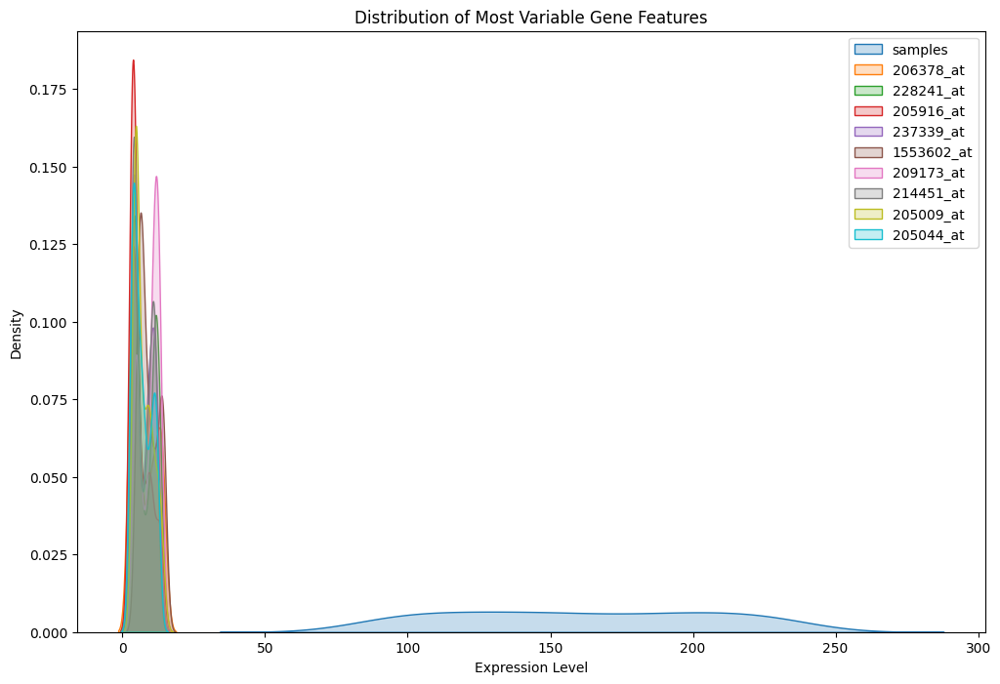

# Gene Expression Analysis and Graph Neural Network (GNN) for Breast Cancer Classification

This notebook provides a workflow for analyzing gene expression data and implementing a Graph Neural Network (GNN) model to classify cancer subtypes.

Data Source: [Curated Microarray Database (CuMiDa) on Kaggle](https://www.kaggle.com/datasets/brunogrisci/breast-cancer-gene-expression-cumida/data)



## Sections Overview

1. **Importing Libraries**: This section imports all the necessary libraries required for data manipulation, visualization, and model building.

2. **Exploratory Data Analysis (EDA)**:
    - **Loading Data**: Load the gene expression dataset.
    - **Looking at the First Few Rows of the Data**: Display the first few rows of the dataset.
    - **Summary of the Data**: Provide a summary of the dataset, including data types and missing values.
    - **Distribution of Cancer Subtypes**: Analyze the distribution of different cancer subtypes in the dataset.
    - **Descriptive Statistics for the First 10 Gene Features**: Display descriptive statistics for the first 10 gene features.
    - **Missing Values in the Data**: Check for missing values in the dataset.
    - **Total Null Count**: Calculate the total number of missing values.
    - **Class Distribution of 'type'**: Analyze the class distribution of the target variable 'type'.
    - **Visualizing the Class Distribution**: Visualize the distribution of cancer subtypes using bar plots and pie charts.
    
    
    - **Analyze Basic Statistics of Gene Features**: Provide summary statistics for all gene features.
    - **Identify the Most Variable Features**: Identify and display the most variable gene features.
    - **Visualize the Distribution of the Top 10 Most Variable Genes**: Visualize the distribution of the top 10 most variable genes.
    

3. **Dimensionality Reduction**:

4. **Graph Creation**:
    - **Define Nodes**: Define nodes representing patients with their gene expression profiles.
    - **Define Edges**: Define edges based on cosine similarity between patients' gene expression profiles.
    - **Create Graph**: Create a graph using the NetworkX library.
    - **Visualize Graph**: Visualize the patient similarity graph.
    - **Save Graph**: Save the graph data for further use in the GNN model.

5. **Implement the GNN Model**:
    - **Load the Graph Data**: Load the edges, node features, and labels from the preprocessed data files.
    - **Train-Test Split**: Split the data into training and testing sets.
    - **Define the GNN Model**: Define a Graph Convolutional Network (GCN) model.
    - **Define Loss and Optimizer**: Define the loss function and optimizer for training the model.
    - **Train the Model with Gradient Clipping and Early Stopping**: Train the model with gradient clipping and early stopping to prevent overfitting.
    - **Visualizations of Model Performance**: Visualize the training loss and test accuracy over epochs.
    - **Confusion Matrix**: Plot the confusion matrix to evaluate the model's performance on the test set.


## Setup
To set up the project and install all dependencies using Poetry, follow these steps:

1. **Install Poetry**: If you don't have Poetry installed, you can install it by following the instructions on the [Poetry website](https://python-poetry.org/docs/#installation).

2. **Navigate to the Project Directory**: Open your terminal and navigate to the project directory:
    ```sh
    cd /Users/your-username/breast-cancer-gnn
    ```
3. **Install Dependencies**: Run the following command to install all dependencies specified in the `pyproject.toml` file:
    ```sh
    poetry install
    ```

4. **Activate the Virtual Environment**: To activate the virtual environment created by Poetry, use:
    ```sh
    poetry shell
    ```

5. **Run the Jupyter Notebook**: Start the Jupyter Notebook server to run the analysis:
    ```sh
    jupyter notebook
    ```

Following these steps will install all necessary dependencies and set up the project for running the gene expression analysis and GNN model.